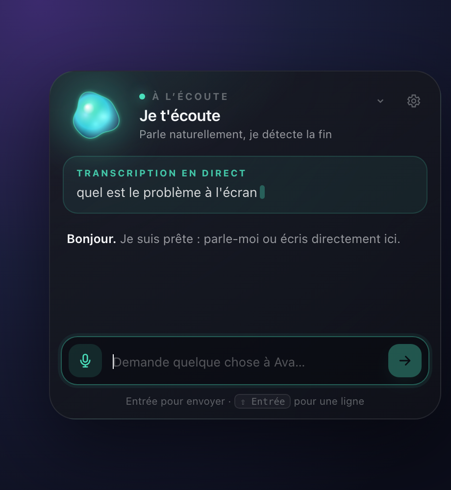
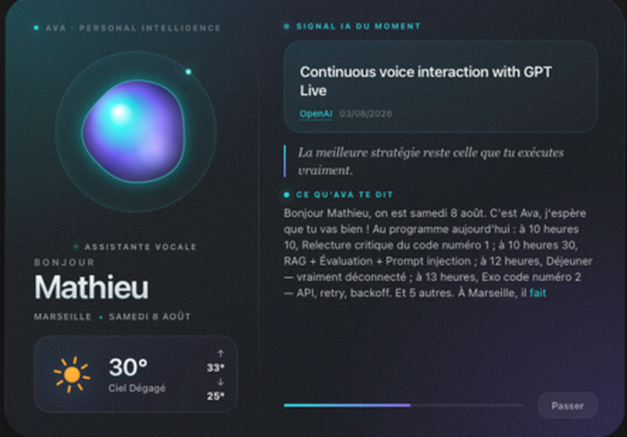
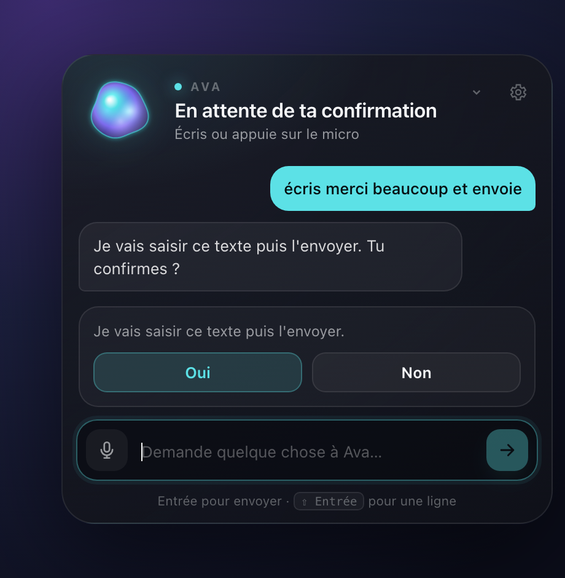

# Ava

Ava is a personal assistant that lives in the macOS menu bar. She wakes on
"bonjour Ava" or a double clap, listens, answers out loud, and can drive the Mac
— open apps, read and write your calendar, look at what's on screen, search the
web.

She speaks French, because that's the language I speak to her in. Everything
around her — the code, the docs, the tests — is in English.

**She runs on the machine.** The wake word, the transcription, the voice and the
screen analysis all happen on the Mac's GPU. No key, no quota, nothing said in
the room leaves the room. That isn't a degraded fallback either — it's the fast
path:

| | over the network | on the Mac |
| --- | --- | --- |
| "oui ?" | 0.51 s | **0.065 s** |
| a command transcribed | 1.85 s | **0.23 s** |
| a 31 s briefing, spoken | — | **1.7 s** |

<p align="center">
  
  
</p>

---

## what makes her different

**She's a menu bar extension, not a window sitting on the desktop.** The icon is
up top next to the others, there's nothing in the Dock, and the panel drops right
under its icon and closes again with one click. The icon itself changes with what
she's doing — idle, listening, thinking, speaking.

**You can mute her without killing her.** "Pause listening" in the menu keeps the
mic open but stops anything from waking her. One click to shut her up, one click
to bring her back.

**One engine, not a stack of fallbacks.** Four chained engines meant four possible
timbres for the same sentence and four delays to pay before reaching the last one.
There's **one** now, with the system `say` as a safety net.

**You can cut her off.** "Stop", the mic button or ⌘. stop the sentence in flight.
On screen, whatever didn't get spoken goes grey — so you never read an answer you
never heard.

**A dead network doesn't make her wait.** One place knows whether the Mac is
online: the first call that fails cuts it short for everyone else, and each one
goes straight to its local fallback. Wifi up but internet down, the first answer
went from **20 s to 3 s**, and every one after that to **zero**.

**She doesn't mistake the TV for you.** The mic hears the whole room. Three
sentences with no action verb and no question read as background conversation,
and she stays quiet instead of googling the name of a player she overheard.

**The morning ritual only plays once a day.** A "bonjour Ava" at 6 pm no longer
restarts the music, the apps and 45 s of briefing — she just says good evening
and listens.

**She learns your turns of phrase.** Whatever keyword routing doesn't catch goes
to a small model that works out the intent, and the answer is kept on disk: the
same sentence, next time, is instant and free.

**She's extensible without touching the code.** Ava reads the open
[Agent Skills](https://agentskills.io) format — drop a folder with a `SKILL.md`
into `skills/` (or `~/Documents/ava-skills`) and she knows how. Two ship with
her. See [`skills/README.md`](skills/README.md).

**She measures where her time goes.** Every interaction leaves a trace — route
taken, latency, network or not, never what was said. `ava-doctor --traces` prints
the table.



---

## anything irreversible asks first

Typing text is reversible, so she just does it. Pressing return, closing a
window, pasting, clicking a button that says *send*, *pay* or *delete* — those
stop and ask, with real buttons.

<p align="center">
  
</p>

There is no path from arbitrary speech to an arbitrary command: an allowlist
turns what you said into one of a fixed set of typed intents, or into nothing at
all. The full picture — what leaves the machine, where the tokens live, how
skills are sandboxed — is in [SECURITY.md](SECURITY.md).

---

## install

macOS, Apple Silicon, Python 3.11+ (3.12 recommended).

```bash
git clone https://github.com/lmveprog/ava.git
cd ava
make install          # or: python3 bootstrap.py
make doctor           # checks libraries, model, mic, permissions
make run
```

`bootstrap.py` creates a `.venv`, installs Ava into it in editable mode, and
downloads the French Vosk model (about 41 MB, checked against its SHA-256). It
never touches your system Python. Afterwards you have two commands:

```bash
.venv/bin/ava           # start her
.venv/bin/ava-doctor    # 30-odd checks, in colour
```

macOS asks for permissions the first time each feature is used, never at startup:
**microphone**, **accessibility** (to type and click), **screen recording** (for
the screen diagnosis), and **automation** for Calendar and Promethee.

For the local screen analysis, install [Ollama](https://ollama.com/) with a
vision model — Ava picks up `gemma3`, `qwen3-vl`, `llama3.2-vision` or `llava`
on her own:

```bash
ollama pull gemma3:12b
```

Optional, both off by default: `MISTRAL_API_KEY` in `.env` switches
transcription to Voxtral, `ELEVENLABS_API_KEY` switches the voice to ElevenLabs.
Copy `.env.example` to `.env` if you want either. Everything else — city, voice,
wake phrases, apps, Google account — lives in the settings panel behind the gear
icon, and is written to `config.json` (mode `0600`, never committed).

---

## using her

- Type into the panel and press enter.
- Click the mic and talk.
- Say `OK Ava, ouvre Spotify` for a full command.
- Say `Bonjour Ava` or double clap for the morning ritual.
- `Ouvre mon agenda et dis-moi ce qui est prévu aujourd'hui`.
- `Ajoute un rendez-vous dentiste demain à 14 heures` — she writes to Google
  Calendar, not just reads it.
- `Ouvre WhatsApp`, `ouvre Xcode`, or any installed app: she indexes them from
  Spotlight and tolerates a mangled pronunciation.
- Leave an error on screen and ask `Quel est ce problème ?` — she hides her
  panel, captures the screen, shows you the thumbnail, and reads it locally.
- `Recherche les nouveautés de Python` for an answer with its sources.

After each spoken answer the status becomes **"tu peux enchaîner"** — just keep
talking. Silence closes the session; `stop`, `c'est bon` or `merci Ava` ends it
outright.


---

## how it's put together

```
src/ava/
  app.py          the loop: wake word, routing, ritual
  paths.py        the one place that knows where anything is written
  config.py       validated settings, saved atomically at 0600
  audio/          wake_words.py (vosk) · voice_tts.py (kokoro, chatterbox)
  brain/          conversation.py · understanding.py · skills.py
  mac/            computer_use.py · app_catalog.py · screen_vision.py · promethee.py
  services/       google_auth.py · google_calendar.py · ai_news.py · web_research.py
  ui/             overlay.py · menubar.py · web/ava.html
```

Deterministic tools (Calendar, opening an app, allowed actions) are kept apart
from generated answers. Sensitive actions ask. Sources and captures are visible
in the panel. A vision model's output can never act on the Mac. Those principles
are borrowed from
[Vibe Buddy](https://github.com/edouardfoussier/hackathon-mistral-vibe),
[Open Interpreter](https://github.com/OpenInterpreter/open-interpreter),
[Leon](https://github.com/leon-ai/leon) and [Cua](https://github.com/trycua/cua).

Everything Ava writes — config, tokens, caches, models — lands next to the
checkout, so `git pull` never touches your settings and deleting the folder
deletes the lot. Set `AVA_HOME` to keep it elsewhere.

## tests

```bash
make test         # 344 tests, about 3 seconds
```

`tests/test_smoke_phrases.py` runs fifty-odd real phrasings through the router
and checks the **route** taken, not the sentence produced — that's how the cases
where "précédent", "salut Ava" or "qu'est-ce que j'ai aujourd'hui" all ended up
in a web search were found. To exercise the offline behaviour without unplugging
the wifi, the API is pointed at a black hole (`https://10.255.255.1`): the
connection times out without ever being refused, which is exactly what a network
that's up but dead looks like.

CI runs the suite on macOS against Python 3.11 and 3.12 on every push.

## credits

The orb is drawn locally on a canvas — the panel loads no remote asset at all.
The skills format, the Vosk model and the ideas borrowed from OpenJarvis are
credited in [THIRD_PARTY_NOTICES.md](THIRD_PARTY_NOTICES.md).

MIT licensed.
