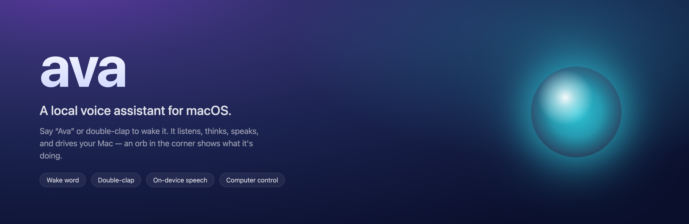
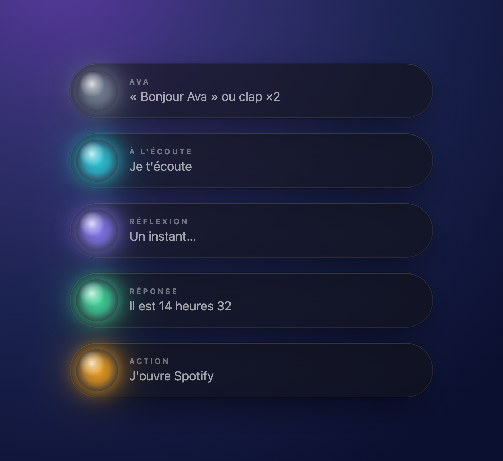

# Ava



Ava is a local voice assistant for macOS. It starts hidden and waits. Say a wake
word or double-clap your hands to bring it up. It listens, thinks, replies out
loud, and can drive your Mac — a small orb in the top-right corner shows what it's
doing, then it disappears again.

Speech recognition runs on-device by default (Whisper / Vosk), and conversation
uses a local model, so nothing leaves your machine unless you opt in to a cloud
voice or transcription API.

## Waking it up

- **Say “Bonjour Ava” or “OK Ava”** to start a voice interaction.
- **Double-clap** to trigger the morning routine: music, tidy app layout on screen,
  and a short spoken briefing (weather, AI news, quote of the day).

## The orb

The overlay is the whole interface. It never opens a window you have to manage — it
just reflects Ava's state and fades out when she's done.



## Install

```bash
python3 -m venv .venv
.venv/bin/pip install -r requirements.txt
cp config.example.json config.json      # optional: customise name, city, apps…
cp .env.example .env                     # optional: voice / transcription keys
.venv/bin/python doctor.py               # checks mic, permissions, models
.venv/bin/python ava.py
```

macOS will ask for **Microphone** and **Accessibility** permissions. The first lets
Ava hear your voice and claps; the second lets it type, click, and move windows.

The French Vosk model is expected here:

```
models/vosk-model-small-fr-0.22/
```

## What you can say

After the wake word, try:

- “ouvre Notion”, “passe sur Code”, “cherche les nouvelles de Mistral”
- “monte le volume”, “morceau suivant”, “minuteur de dix minutes”
- “prends une capture d'écran”, “écris Bonjour, c'est confirmé”
- “clique sur continuer”, “descends la page”, “ferme l'onglet”
- “parle-moi des modèles de diffusion” to chat with the local model

Anything that could send, paste, close, or delete asks for a separate confirmation:
“Bonjour Ava, confirme” or “Bonjour Ava, annule”.

## Configuration

Settings live in `config.json` (created from `config.example.json`) and can also be
edited from the overlay's panel. It holds the city, voice, morning apps, clap
sensitivity, conversation backend, and the computer-use policy — validated and saved
atomically by `ava_config.py`.

Secrets stay in `.env` only. If ElevenLabs isn't configured, Ava falls back to the
macOS system voice; if Mistral/Voxtral isn't configured, it falls back to local
Whisper.

Local chat looks for an OpenAI-compatible server at `http://127.0.0.1:1234/v1` by
default (LM Studio). Load a model and start its server to enable conversation.

## Development

```bash
.venv/bin/python -m unittest discover -s tests -v
.venv/bin/python -m py_compile *.py
AVA_DEBUG=1 .venv/bin/python ava.py
AVA_OVERLAY=0 .venv/bin/python ava.py     # run without the overlay
```

## Project layout

| File | Role |
| --- | --- |
| `ava.py` | entry point and command routing |
| `assistant_state.py` | thread-safe state machine |
| `wake_words.py` | wake phrase and clap detection |
| `computer_use.py` | allow-listed macOS actions with confirmations |
| `conversation.py` | private chat with a local model |
| `ava_config.py` | settings schema, validation, save/reload |
| `overlay.py` + `overlay/ava.html` | the orb overlay and settings panel |

## License

MIT — see [LICENSE](LICENSE).
